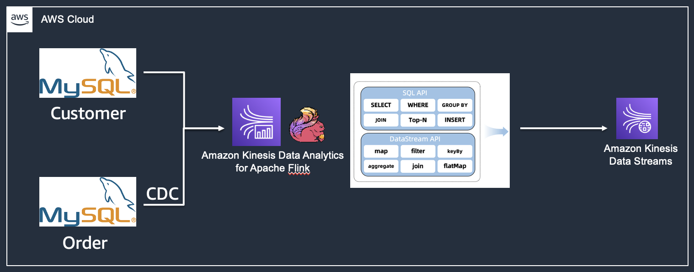

# Using Flink CDC to Capture MySQL data change and publish processed result to Kinesis Data Stream
## Backgroud
In various scenarios, customer has the need to capture the change from relational databases, perform data transformation, and stream the resulting data to downstream for further use. Some common scenarios includes

- Database Migration --- Migration to a new database that incurs schema change can adopt to this solution. Both databases can run concurrently to avoid downtown during the switch.
- Data Lake Ingression --- Real time data processing pipeline to aggregate data and load into the data lake.
- Database Synchronization --- Use this solution to keep data in different databases in sync.


## Architecture

- Flink CDC can capture the change from databases including MySQL, PostgreSQL, SQL Server
- Flink running on Kinesis Data Analytics will perform join, map, filter... operations to transform data into specific form. 
- The resulting data can be sinked into destinations such as Kinesis Data Stream for further processing.



## Prerequisite

- Turn on binlog in MySQL where CDC will be captured
   - MysSQL: https://docs.aws.amazon.com/AmazonRDS/latest/UserGuide/USER_LogAccess.MySQL.BinaryFormat.html
   - Aurora: https://aws.amazon.com/premiumsupport/knowledge-center/enable-binary-logging-aurora/

## Setup

1. Fill in the MySQL and Kinesis configuration in the code with the actual information.
2. Run ```mvm package``` to build the maven project. 
3. Upload the **flink-cdc-mysql-1.0-SNAPSHOT.jar** file under target/ folder to S3. 
4. Start a Kinesis Data Analytics application with the S3 path containing the jar file.
5. After inserting an order record in Order table with valid customerId, the Flink application will join the order record with the customer record. The resulting record will appear in the Kinesis Data Stream.